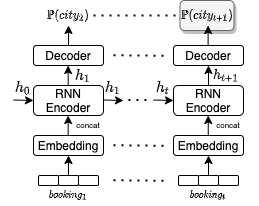

# Booking.com Challenge - WebTour 2021 <br> ACM WSDM workshop
4th place solution for [Booking.com](https://www.bookingchallenge.com/final-leaderboard-results)'s next destination
recommendation challenge.

[Documentation](https://mbaigorria.github.io/booking-challenge-2021-recsys) |
[Github](https://github.com/mbaigorria/booking-challenge-2021-recsys) |
[Colab](https://colab.research.google.com/drive/1202KKmzrIZY0t9dhOoA5zINPI0qkx4lX)

#### Recommended Citation

```
@inproceedings{DOI_CODE,
 author = {Baigorria Alonso, Martín},
 booktitle = {ACM WSDM Workshop on Web Tourism (WSDM WebTour’21)},
 howpublished = {\url{https://mbaigorria.github.io/booking-challenge-2021-recsys}},
 title = {Data Augmentation Using Many-To-Many RNNs for Session-Aware Recommender Systems},
 year = {2021}
}
```

## Model

My solution is a Sequence Aware Recommender System implemented with an RNN based Many-To-Many architecture.




## Setting up resources

To set up the environment with all the datasets and resources, you must first call:
```
bash get_resources.sh
```

## Installing and running package

You can install the package in development mode and get our submission.
```
pip install -e .
python3 -m recsys.src.submission
```

## Running Docker image

You must first install [nvidia-docker](https://github.com/NVIDIA/nvidia-docker) to run the Docker image with a GPU.

Then, install the base image we use:
```
docker pull nvidia/cuda
```

Finally, build and run our image:
```
docker build -t booking_challenge .
docker run --runtime=nvidia --ipc=host --mount source=${path_to_resources},target=/home/user/resources,type=bind recsys
```